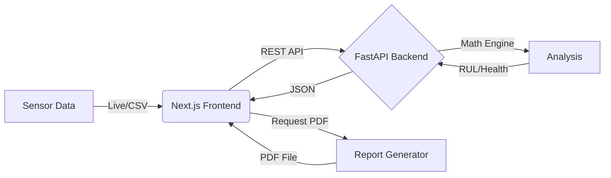

# QorSense v1 - Advanced Industrial Sensor Monitoring

QorSense v1 is a production-ready predictive maintenance application designed to monitor industrial sensor data (Flow, Pressure, Temperature). It combines a high-performance **FastAPI** backend for advanced mathematical analysis with a modern **Next.js** frontend for a responsive, professional dashboard.


## 🚀 Key Features

### 1. Real-Time Monitoring & Analysis
- **Live Data Streaming**: Visualize sensor data in real-time with dynamic charts.
- **Multi-Metric Analysis**: Simultaneous calculation of:
  - **Bias & Slope**: Detect drift and offset.
  - **SNR (Signal-to-Noise Ratio)**: Monitor signal quality.
  - **Hysteresis**: Detect mechanical play or lag.
  - **Hurst Exponent (DFA)**: Identify long-term memory and persistence in signal patterns.

### 2. Predictive Maintenance (RUL)
- **RUL Prediction**: Estimates **Remaining Useful Life** based on current drift trends and critical thresholds.
- **AI Diagnosis**: Rule-based AI engine provides instant diagnosis (e.g., "Critical Trend Drift", "High Noise Level") and actionable recommendations.

### 3. Data Flexibility
- **Synthetic Data Generator**: Simulate various scenarios (Normal, Drifting, Noisy, Oscillation) for testing and demo purposes.
- **CSV Upload**: Import and analyze your own historical sensor data files (`.csv`, `.txt`).

### 4. Professional Reporting
- **PDF Export**: Generate comprehensive PDF reports including:
  - System Health Score (0-100)
  - Detailed Metrics Table
  - AI Diagnosis & Recommendations
  - Visual Trend Charts

### 5. Modern UI/UX
- **Interactive Dashboard**: Built with Next.js, Tailwind CSS, and Recharts.
- **Radar Charts**: Multi-dimensional visualization of sensor health metrics.
- **Responsive Design**: Optimized for various screen sizes.
- **Dark/Light Mode**: Adaptive visual themes.

---

## 🏗 Architecture

The project follows a modern full-stack architecture:

- **Backend (Python/FastAPI)**:
  - `analysis.py`: Core math engine (NumPy, SciPy, Pandas).
  - `main.py`: REST API endpoints.
  - `report_gen.py`: PDF generation logic.
- **Frontend (TypeScript/Next.js)**:
  - `app/`: App Router based pages.
  - `components/`: Reusable UI components (Sidebar, Charts, MetricCards).
  - `lib/api.ts`: Typed API client.



---

## � Installation & Setup

### Prerequisites
- **Python 3.9+**
- **Node.js 18+** & **npm**

### 1. Clone Repository
```bash
git clone https://github.com/diferansiyel1/qorsense_v1.git
cd qorsense_v1
```

### 2. Backend Setup
```bash
# Create virtual environment (optional but recommended)
python -m venv venv
source venv/bin/activate  # On Windows: venv\Scripts\activate

# Install dependencies
pip install -r requirements.txt
```

### 3. Frontend Setup
```bash
cd frontend-next
npm install
cd ..
```

---

## ▶️ Running the Application

We provide a convenient script to launch both the backend and frontend simultaneously:

```bash
chmod +x run_next.sh
./run_next.sh
```

This will:
1. Start the **FastAPI Backend** on `http://localhost:8000`
2. Start the **Next.js Frontend** on `http://localhost:3000`
3. Automatically open the dashboard in your browser.

---

## 🧪 Testing

Run the backend unit tests to verify the analysis engine:

```bash
# Run tests using pytest
pytest tests/
```

---

## 📄 License

Proprietary - QorSense Technologies.
